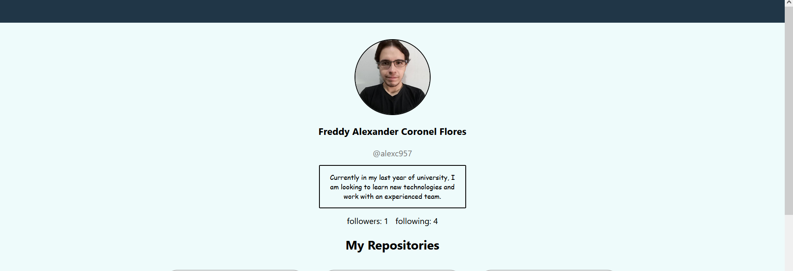
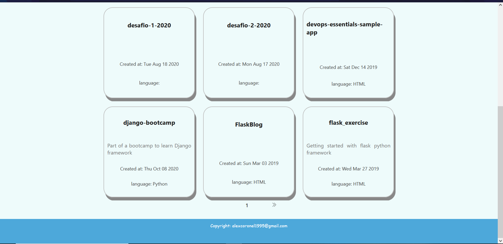

# My Github Profile 
This is a React Project to show my github profile using the free version of the Github API. For the layout, since it's a simple web app, I only used flexbox. 

## Dependencies
1. react@17.0.2.

## Project Structure
Since we are using react we use components to split the web app into separated components. Everything is rendered in the App.js but we have the following folder estructure:
1. components: every component that is part of our application. We list the following:
   1. Card.js: represents a reusable card.
   2. CardContainer.js: grid container using flexbox. 
   3. Header.js the header with basic information.
   4. Main.js: everything that is the main part of the app.
   5. Pagination.js: component to help with the navigation.
2. hooks:
   1. useFetch: custom hook to fetch data using the Github API. 

## Running Locally 
1. clone the repository using git or download it as a zip.
2. navigate to the repository folder and run the following command to install the dependencies.
   1. `yarn install`

3. start the development server by running the following:
   1. `yarn start`

4. open a browser and navigate to [http://localhost:3000](http://localhost:3000) to see the main page. 

## Screenshots 
### first part of the home

### bottom part of the home 

